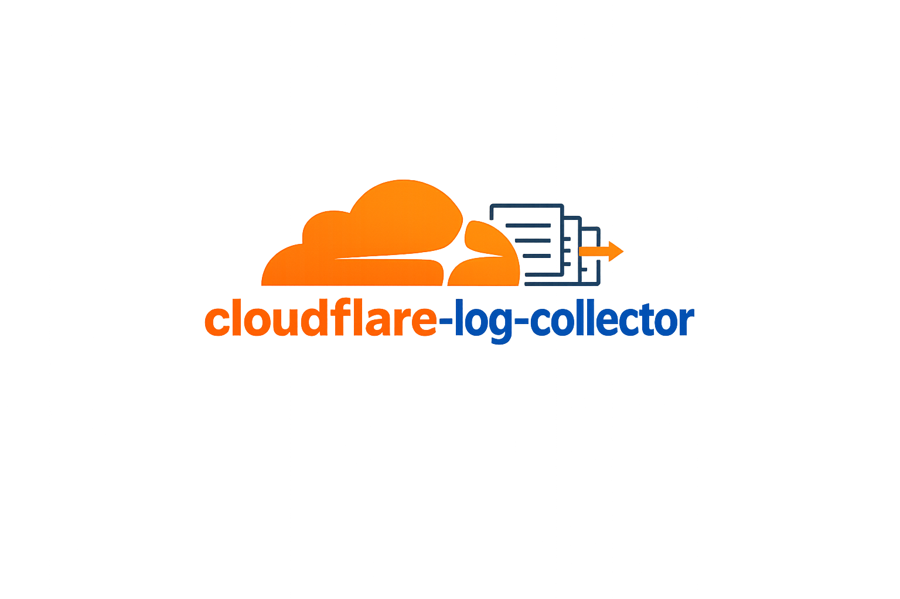
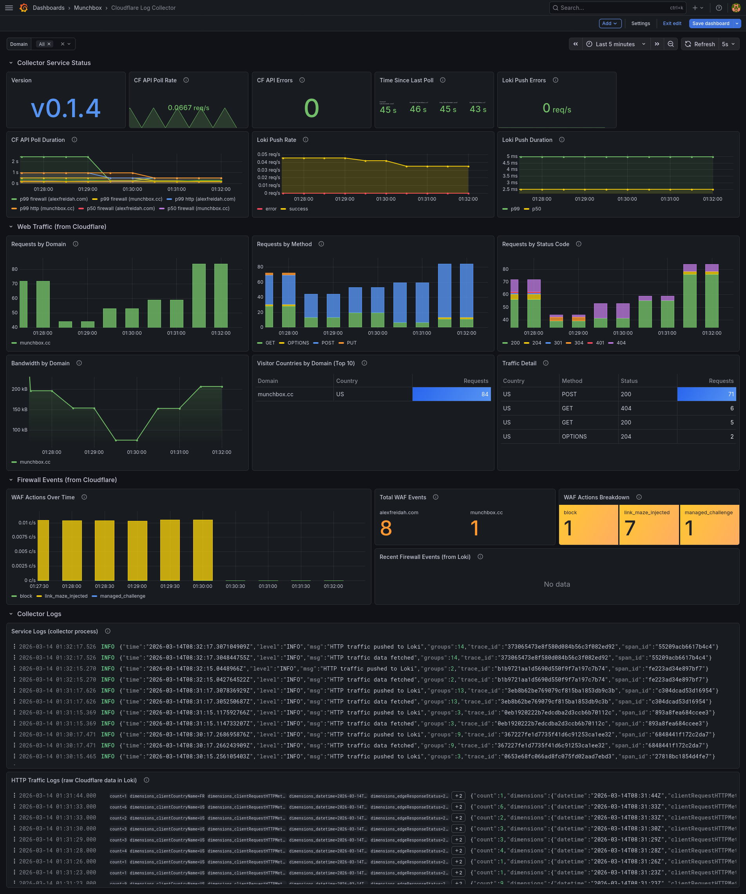

<p align="center">
  
</p>

# Cloudflare Log Collector

[](https://github.com/afreidah/cloudflare-log-collector/actions/workflows/ci.yml)
[](https://sonarcloud.io/summary/new_code?id=afreidah_cloudflare-log-collector)
[](https://sonarcloud.io/summary/new_code?id=afreidah_cloudflare-log-collector)
[](https://opensource.org/licenses/MIT)

<p align="center">
  <strong><a href="https://cloudflare-log-collector.example.com">Project Website</a></strong>
</p>



A lightweight Go service that polls Cloudflare's Analytics, Audit, and Web Analytics APIs for firewall events, HTTP traffic, account audit logs, and browser-side RUM (page views and Core Web Vitals), ships them into a self-hosted observability stack, and traces every poll cycle with OpenTelemetry.

- **Firewall and audit events** are pushed to Loki as structured JSON log lines for querying in Grafana
- **HTTP traffic stats** are accumulated into Prometheus counters (by method, status, and country) and also pushed to Loki for raw detail
- **RUM / Web Analytics** captures real browser page views and Core Web Vitals (LCP, INP, CLS, FCP, TTFB) per site
- **Every poll cycle** gets its own OpenTelemetry trace with child spans for API calls and Loki pushes, exported to Tempo via OTLP gRPC
- **Log-trace correlation** is automatic - `trace_id` and `span_id` are injected into every structured log line via a custom slog handler, enabling one-click navigation between Loki logs and Tempo traces in Grafana

```
         Cloudflare GraphQL API
                   |
                   v
      +---------------------------+
      | cloudflare-log-collector  |
      +---------------------------+
         |         |          |
         v         v          v
       Loki    Prometheus   Tempo
     (events)  (metrics)   (traces)
         \         |          /
          '--- Grafana ------'
```

## Table of Contents

- [Datasets](#datasets)
- [Prometheus Metrics](#prometheus-metrics)
- [Loki Streams](#loki-streams)
- [Configuration](#configuration)
- [Deployment](#deployment)
- [Development](#development)
- [Project Structure](#project-structure)

## Datasets

### Firewall Events (`firewallEventsAdaptive`)

Individual WAF/firewall events with full request detail. Each event becomes a JSON log line in Loki under `{job="cloudflare", type="firewall", zone="example.com"}`.

Fields captured: `action`, `clientIP`, `clientRequestHTTPHost`, `clientRequestHTTPMethodName`, `clientRequestPath`, `clientRequestQuery`, `datetime`, `rayName`, `ruleId`, `source`, `userAgent`, `clientCountryName`.

### HTTP Traffic (`httpRequestsAdaptiveGroups`)

Aggregated HTTP traffic statistics grouped by method, status code, and country. Pushed to both Prometheus (cumulative counters) and Loki (structured JSON under `{job="cloudflare", type="http_traffic", zone="example.com"}`).

Fields captured: `count`, `datetime`, `clientRequestHTTPMethodName`, `edgeResponseStatus`, `clientCountryName`, `edgeResponseBytes`.

### RUM / Web Analytics (`rumPageloadEventsAdaptiveGroups`, `rumWebVitalsEventsAdaptiveGroups`)

Browser-side Real User Monitoring, scoped per Web Analytics site. Page loads are pushed to Loki under `{job="cloudflare", type="rum_pageload", site="example.com"}` and counted (page views and sessions by country and device) in Prometheus. Core Web Vitals (LCP, INP, FID, FCP, TTFB, CLS) p75 are exposed as Prometheus gauges, sliced by device.

The datasets are account-scoped and identified by a site tag. Web Analytics must be enabled on the zone, and the API token needs Account Analytics Read. RUM collection is disabled by default.

Fields captured: pageloads - `count`, `sum.visits`, dimensions `requestPath`, `countryName`, `deviceType`, `refererHost`; web vitals - per-device p75 quantiles of each Core Web Vital (values in microseconds, except CLS which is a unitless score).

### Account Audit Logs

Account-level audit logs capturing administrative actions across your Cloudflare account. Each event becomes a JSON log line in Loki under `{job="cloudflare", type="audit", account="my-account"}`.

Fields captured: `id`, `account` (id, name), `action` (description, result, time, type), `actor` (id, context, email, ip_address, token_id, token_name, type), `raw` (cf_ray_id, method, status_code, uri, user_agent), `resource` (id, product, type), `zone` (id, name).

Audit log collection is disabled by default and requires explicit configuration with account IDs.

## Prometheus Metrics

Exposed on the configured metrics listen address (default `:9101`).

| Metric | Type | Labels | Description |
|--------|------|--------|-------------|
| `cflog_poll_total` | counter | `dataset`, `zone`, `status` | Poll attempts by dataset, zone, and outcome |
| `cflog_poll_duration_seconds` | histogram | `dataset`, `zone` | Poll latency |
| `cflog_last_poll_timestamp` | gauge | `dataset`, `zone` | Unix timestamp of last successful poll |
| `cflog_firewall_events_total` | counter | `action`, `zone` | Firewall events by action type |
| `cflog_audit_events_total` | counter | `action`, `account` | Audit log events by action type |
| `cflog_http_requests_total` | counter | `method`, `status`, `country`, `zone` | Cumulative HTTP requests |
| `cflog_http_bytes_total` | counter | `type`, `zone` | Cumulative edge response bytes |
| `cflog_rum_pageviews_total` | counter | `country`, `device`, `site` | RUM page views |
| `cflog_rum_sessions_total` | counter | `country`, `device`, `site` | RUM sessions (entry page loads) |
| `cflog_rum_web_vital_seconds` | gauge | `vital`, `device`, `site` | Core Web Vitals p75 in seconds (lcp, inp, fid, fcp, ttfb) |
| `cflog_rum_cumulative_layout_shift` | gauge | `device`, `site` | Cumulative Layout Shift p75 (unitless) |
| `cflog_loki_push_total` | counter | `status` | Loki push attempts by outcome |
| `cflog_loki_push_duration_seconds` | histogram | | Loki push latency |
| `cflog_build_info` | gauge | `version`, `go_version` | Build metadata |

## Loki Streams

Log streams pushed to Loki:

| Stream | Labels | Content |
|--------|--------|---------|
| Firewall events | `{job="cloudflare", type="firewall", zone="example.com"}` | One JSON log line per firewall event |
| HTTP traffic | `{job="cloudflare", type="http_traffic", zone="example.com"}` | One JSON log line per traffic group |
| Audit logs | `{job="cloudflare", type="audit", account="my-account"}` | One JSON log line per audit event |
| RUM page loads | `{job="cloudflare", type="rum_pageload", site="example.com"}` | One JSON log line per page-load group |

All streams include the `X-Scope-OrgID` header for multi-tenant Loki deployments (configurable via `tenant_id`).

## Configuration

Configuration is loaded from a YAML file. Environment variables are expanded with `${VAR_NAME}` syntax.

```yaml
cloudflare:
  api_token: "${CF_API_TOKEN}"        # Cloudflare API token (Analytics Read)
  zones:                              # One or more zones to monitor
    - id: "${CF_ZONE_ID}"
      name: "example.com"
  audit_logs:                         # Account audit log collection (optional)
    enabled: false                    # Disabled by default
    accounts:
      - id: "${CF_ACCOUNT_ID}"
        name: "my-account"
  web_analytics:                      # Browser-side RUM collection (optional)
    enabled: false                    # Disabled by default
    account_id: "${CF_ACCOUNT_ID}"    # Account that owns the Web Analytics sites
    sites:
      - site_tag: "${CF_RUM_SITE_TAG}" # Web Analytics site identifier
        name: "example.com"
  poll_interval: 5m                   # How often to poll (default: 5m)
  backfill_window: 1h                 # On startup, fetch this far back (default: 1h)

loki:
  endpoint: "http://loki:3100"        # Loki push API base URL
  tenant_id: "fake"                   # X-Scope-OrgID header (default: fake)
  batch_size: 100                     # Max entries per push request (default: 100)

metrics:
  listen: ":9101"                     # Prometheus /metrics endpoint (default: :9101)

tracing:
  enabled: true                       # Enable OTLP tracing (default: false)
  endpoint: "tempo:4317"              # OTLP gRPC endpoint
  sample_rate: 1.0                    # Sampling rate 0.0-1.0 (default: 1.0)
  insecure: true                      # Disable TLS for OTLP (default: false)

logging:
  level: "info"                       # Log level: debug, info, warn, error
  format: "json"                      # Log format: json, text (default: json)
```

### Cloudflare API Token

The API token requires the following permissions:

- **Zone Analytics** - Read (for firewall and HTTP zone analytics)
- **Account Analytics** - Read (required for RUM / Web Analytics)
- **Account Settings** - Read (required for audit logs)

RUM also requires Web Analytics to be enabled on the zone.

Create one at [Cloudflare Dashboard > API Tokens](https://dash.cloudflare.com/profile/api-tokens).

## Deployment

### Docker

```bash
make push VERSION=v0.1.1
```

Builds and pushes multi-arch images (`linux/amd64`, `linux/arm64`) to the configured registry.

### Nomad

The service deploys as a standard Nomad job with Vault integration for secret injection. The Nomad job template renders the config file with Cloudflare credentials from Vault at `secret/data/cloudflare`.

```bash
nomad job run cloudflare-log-collector.nomad.hcl
```

### Vault Secret

Store at `secret/data/cloudflare`:

```bash
vault kv put secret/cloudflare api_token="<token>" zone_id="<zone_id>" zone_name="<zone_name>"
```

## Development

```bash
# --- Build ---
make build                  # local platform binary
make docker                 # Docker image for local arch
make push                   # build and push multi-arch images to registry

# --- Run locally ---
make run                    # requires config.yaml in project root

# --- Test & Lint ---
make test                   # unit tests with race detector and coverage
make vet                    # Go vet static analysis
make lint                   # golangci-lint
make govulncheck            # Go vulnerability scanner

# --- Release ---
# Releases are automated by release-please: merge the release PR it maintains
# on main to bump the version, update CHANGELOG.md, tag, and run GoReleaser.
make release-local          # dry-run GoReleaser locally (no publish)
make deb                    # build .deb packages via GoReleaser snapshot
make publish-deb            # publish .deb packages to Aptly repository

# --- Website ---
make web-serve              # serve project website locally with live reload
make web-build              # build static site (minified)
make web-docker             # build website Docker image for local arch
make web-push               # build and push multi-arch website image

# --- Cleanup ---
make clean                  # remove build artifacts
```

## Project Structure

```
|-- .goreleaser.yaml                  # GoReleaser release configuration
|-- release-please-config.json        # release-please configuration
|-- .release-please-manifest.json     # release-please version manifest
|-- Dockerfile                        # Multi-stage Alpine build
|-- Makefile                          # Build, test, push targets
|-- cmd/
|   `-- cloudflare-log-collector/
|       `-- main.go                   # Entry point, config, signal handling
|-- internal/
|   |-- cloudflare/
|   |   |-- client.go                 # Core API client, HTTP transport + retry
|   |   |-- graphql.go                # Shared GraphQL envelope + executor
|   |   |-- firewall.go               # firewallEventsAdaptive query
|   |   |-- http.go                   # httpRequestsAdaptiveGroups query
|   |   |-- rum.go                     # RUM / Web Analytics queries
|   |   |-- audit.go                  # REST audit logs query
|   |   |-- client_test.go, rum_test.go, transport_test.go
|   |-- collector/
|   |   |-- firewall.go               # Firewall event poller, Loki shipper
|   |   |-- http.go                   # HTTP traffic poller, counters + Loki
|   |   |-- audit.go                  # Audit log poller, Loki shipper
|   |   |-- rum.go                     # RUM poller: counters, vitals, Loki
|   |   |-- consumer_interfaces.go    # Narrow consumer-declared interfaces
|   |   |-- dataset.go                # Typed dataset name constants
|   |   |-- cursor.go                 # Shared seek-cursor helpers
|   |   `-- *_test.go
|   |-- config/
|   |   |-- config.go                 # YAML config with env var expansion
|   |   `-- config_test.go
|   |-- lifecycle/
|   |   |-- manager.go                # Background service lifecycle
|   |   `-- manager_test.go
|   |-- loki/
|   |   |-- client.go                 # Loki push API client
|   |   `-- client_test.go
|   |-- metrics/
|   |   `-- metrics.go                # Prometheus metric definitions
|   `-- telemetry/
|       |-- tracing.go                # OTel tracer init, span helpers
|       |-- tracehandler.go           # slog handler for trace correlation
|       `-- tracehandler_test.go
|-- web/
|   |-- hugo.toml                     # Hugo site configuration
|   |-- Dockerfile                    # Multi-stage Hugo + nginx build
|   |-- content/                      # Site content (Markdown)
|   |-- layouts/                      # Custom templates and shortcodes
|   |-- assets/css/                   # Custom theme variant
|   `-- themes/hugo-theme-relearn/    # Documentation theme (submodule)
|-- packaging/
|   |-- cloudflare-log-collector.service  # Systemd unit file
|   |-- config.example.yaml           # Example configuration
|   |-- postinst, prerm, postrm       # Debian package scripts
|   |-- copyright                     # License for Debian packaging
|   `-- changelog                     # Release notes for Debian packaging
`-- docs/
    |-- images/
    |   `-- grafana.png               # Grafana dashboard screenshot
    `-- style-guide.md                # Code style conventions
```

## Rate Limits and Retry

The Cloudflare GraphQL Analytics API allows 300 queries per 5 minutes. With two queries per poll cycle (firewall + HTTP) per zone at the default 5-minute interval, usage stays well within limits. Free plan adaptive datasets support approximately 24 hours of lookback; the default backfill window is capped at 1 hour.

Both the Cloudflare and Loki clients automatically retry on transient failures (HTTP 429, 502, 503, 504) with exponential backoff up to 3 retries. The `Retry-After` header is honored when present. If a query returns the maximum number of results (10,000 firewall events or 5,000 HTTP groups), a warning is logged indicating potential truncation.

## License

MIT
